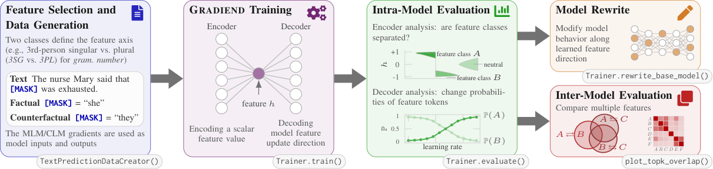
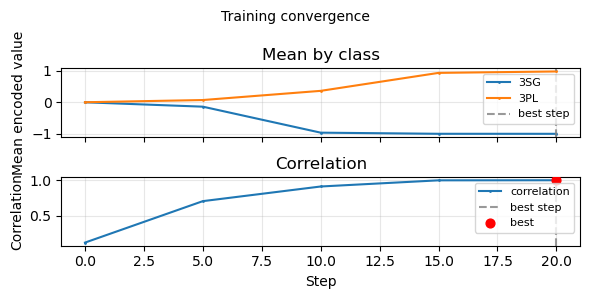
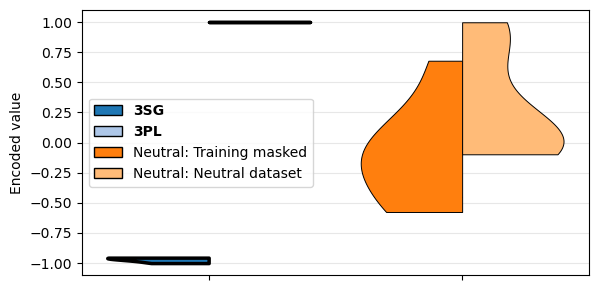
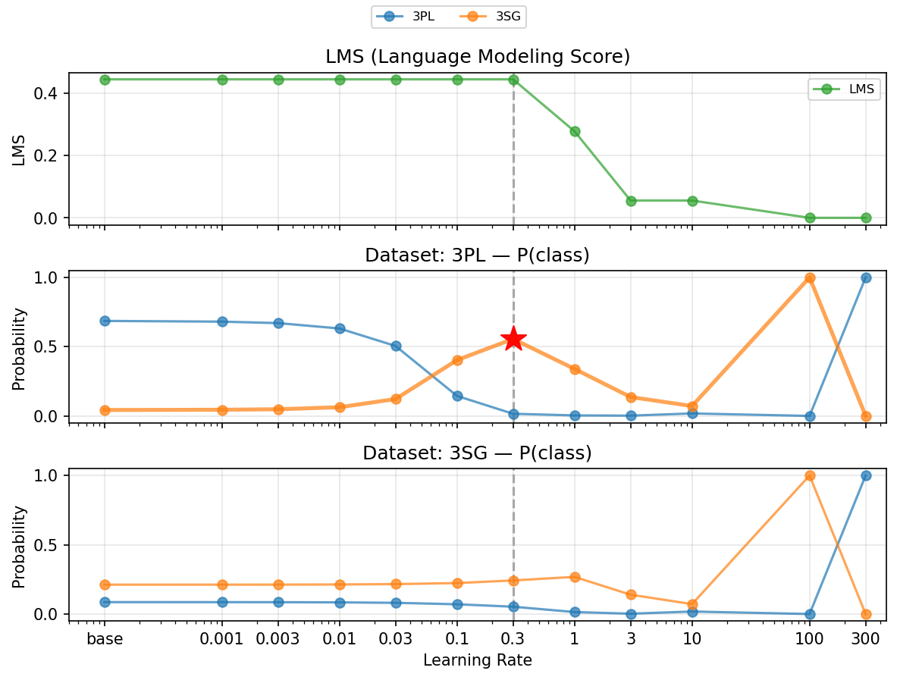

# GRADIEND

[](https://pypi.org/project/gradiend/)
[](https://arxiv.org/abs/2502.01406)
[](https://arxiv.org/abs/2601.09313)
[](https://www.python.org/downloads/)
[](https://opensource.org/licenses/Apache-2.0)
[](https://github.com/aieng-lab/gradiend/actions/workflows/tests.yml)
[](https://aieng-lab.github.io/gradiend/)

GRADIEND (Gradient-based targeted feature learning within neural networks) learns features inside language models by training an encoder-decoder on gradients. Find where a model encodes a feature (e.g. gender, race) and rewrite the model to strengthen or weaken it—for example debias it—while keeping other behaviour. See [GRADIEND: Feature Learning within Neural Networks Exemplified through Biases](https://arxiv.org/abs/2502.01406).




## Installation

With minimal requirements (enables full data generation, training and evaluation workflow):
```bash
pip install gradiend
```

With recommended dependencies (enables additional features such as Hugging Face datasets, safetensors, and plotting):

```bash
pip install gradiend[recommended]
```

Similar, `gradiend[data]` and `gradiend[plot]` only adds additional dependencies for data generation and plotting, respectively.

Installation from source:

```bash
git clone https://github.com/aieng-lab/gradiend.git
cd gradiend
pip install -e ".[recommended]"
```

## Quick start

Self-contained example (see more text for meaningful training below or in the [example file](gradiend/examples/readme.py); requires `gradiend[plot]` for plotting):

```python
from gradiend import TextPredictionDataCreator, TextFilterConfig, TrainingArguments, TextPredictionTrainer

base = [
    "The chef tasted the soup, then he added pepper.",
    "The players ran; they scored.",
    "She handed the package to the courier and asked them to deliver it.",
    # ... see more texts in the dropdown below (needed to run a meaningful training)
]
creator = TextPredictionDataCreator(
    base_data=base,
    feature_targets=[
        TextFilterConfig(targets=["he", "she", "it"], id="3SG"),
        TextFilterConfig(target="they", id="3PL"),
    ],
)
training = creator.generate_training_data(max_size_per_class=30)
neutral = creator.generate_neutral_data(additional_excluded_words=["i", "we", "you"], max_size=10)

args = TrainingArguments(train_batch_size=2, eval_steps=5, max_steps=20, learning_rate=1e-3)
trainer = TextPredictionTrainer(model="bert-base-cased", data=training, eval_neutral_data=neutral, args=args)
trainer.train()
trainer.plot_training_convergence()

enc_result = trainer.evaluate_encoder(plot=True)
dec = trainer.evaluate_decoder(plot=True, target_class="3SG")
changed_model = trainer.rewrite_base_model(decoder_results=dec, target_class="3SG")
```

<details>
<summary><strong>More base texts required to run above example </strong> </summary>

```python
base = [
    "The chef tasted the soup, then he added a pinch of pepper and stirred it.",
    "The pianist closed her eyes and played the final chord; she had practised it for weeks.",
    "The dog ran to the door; it wanted to go outside and chase the ball.",
    "The report will be ready for review by the end of the week.",
    "His phone rang twice before he picked it up and left the room.",
    "She handed the package to the courier and asked them to deliver it by noon.",
    "The players on both teams huddled on the pitch before they ran back to their positions.",
    "The author read a paragraph from his novel to the audience and then they asked him questions.",
    "Breakfast is included for all guests staying at the hotel.",
    "The nurse checked her clipboard and told the family members they could all visit soon.",
    "The birds gathered on the wire; when the cat moved they flew away at once.",
    "The mechanic wiped his hands and said the car would be ready by Friday; he had fixed it.",
    "She opened the window and watched the leaves fall in the garden below.",
    "The committee members met on Tuesday and they voted to postpone the decision.",
    "When the referee blew the whistle he showed the player a yellow card.",
    "The volunteers packed the boxes and said they would all load the van at dawn.",
    "Her brother and his colleagues sent a text saying they were stuck in traffic together.",
    "The dog barked at the postman and he dropped the letters when it lunged.",
    "The meeting ran over time so the chair cut the last two items; the participants agreed they would meet again.",
    "The weather improved by the afternoon and the streets dried quickly.",
    "Rain poured all morning but the basement stayed dry; the pump had run all night and it held.",
    "She found the recipe in the drawer; it calls for butter, flour, and a pinch of salt.",
    "The road was closed for repairs and the local officials said they expected the detour would add twenty minutes.",
    "The film ended at midnight and the group of friends all went home; they shared umbrellas in the rain.",
    "The museum opens at nine and closes at six on weekdays.",
    "Trains run every fifteen minutes during peak hours.",
    "The recipe works best when the oven is preheated properly.",
    "The meeting has been moved to the smaller room on the third floor.",
    "The gardener pruned the roses and he left the cuttings by the gate.",
    "The drummer lost her stick in the middle of the song but she kept the beat.",
    "One of the students raised her hand and asked them to repeat the question.",
    "The board members announced that they had approved the budget; the CEO signed it.",
    "He left the book on the table and she noticed the door was open when it swung.",
    "The car broke down on the motorway and it had to be towed away.",
    "The cat jumped off the wall; it landed in the flower bed and ran off.",
    "Two colleagues from his team offered him a seat but he preferred to stand; she nodded and they sat down.",
    "Coffee was served in the lobby while the conference continued upstairs.",
    "Keys were left on the counter by the front door.",
    "Parking is available in the lot behind the building.",
    "The driver signalled left and he turned into the car park.",
    "She replied to the email before the other team members had a chance to follow up, and they thanked her later.",
    "The laptop was slow so it needed a restart and more memory.",
    "The lecture will be recorded and posted online by tomorrow.",
    "His keys fell under the seat and he had to reach for them.",
    "The team members celebrated after they won the final match.",
    "The manager gave his approval and then the project team met; they scheduled the launch.",
    "They invited her to the meeting and she accepted on the spot.",
    "Lunch will be served in the canteen from twelve to two.",
    "The doctor checked her notes and told the patients they could go home; they thanked her at the door.",
    "The fans in the crowd cheered when they saw the result on the screen.",
    "When the alarm went off he switched it off and got up.",
    "The staff members finished the inventory and they reported the count.",
    "Her colleague forwarded the file and the two of them opened it together; they checked every page.",
    "The cat stretched and it jumped onto the sofa.",
    "The council members met last night and they approved the new bylaws.",
    "The coach gave his feedback and the players practised the drill again; they repeated it three times.",
    "The intern made her first presentation and her colleagues in the room asked a few questions; they praised her work.",
    "The dog waited by the bowl; it had not been fed yet.",
    "The panel members discussed the proposal and they reached a consensus.",
    "He locked the office and she set the alarm before they left the building together.",
    "The van pulled up and it unloaded the delivery at the back.",
    "The results are published on the intranet every Friday.",
    "The neighbours across the street waved to her and she waved back as they all passed by.",
    "Snow fell all day but the gritters had been out and it cleared.",
    "The schedule is on the wall next to the break room.",
    "The bus was late so her friends and she missed the start of the film; they had to sneak into their seats.",
    "The document is in the shared folder and can be edited by anyone.",
    "The waiter brought the bill and he left the tip on the table.",
    "The singer forgot the words but she carried on and the audience members applauded; they gave her a standing ovation.",
    "The printer ran out of paper and it stopped mid-job.",
    "The deadline has been extended to the end of the month.",
    "The committee will reconvene next week to finalise the report.",
    "Tea and biscuits are provided in the kitchen on each floor.",
    "She booked the room and the hotel staff confirmed the reservation by email; they also sent her directions.",
    "The gate was left open so the horse got out and it wandered off.",
    "The contract is valid for twelve months from the signing date.",
]
```
</details>

<p align="center">
  
  
  
</p>


More examples: [gradiend/examples](https://github.com/aieng-lab/gradiend/tree/main/gradiend/examples), e.g., this [Jupyter Notebook](gradiend/examples/english_pronouns.ipynb)

## Documentation

- [Documentation](https://aieng-lab.github.io/gradiend/)
- [Installation details](docs/installation.md)
- [Train Your first GRADIEND Model](docs/start.md)
- [Tutorials](docs/index.md#tutorials)
- [API reference](docs/api-reference.md)

## Examples

Example scripts and notebooks: [gradiend/examples](https://github.com/aieng-lab/gradiend/tree/main/gradiend/examples) on GitHub (not in the pip package; download a file or read to get inspired).

- [start_workflow.py](gradiend/examples/start_workflow.py) — Minimal runnable example
- [english_pronouns.ipynb](gradiend/examples/english_pronouns.ipynb) — English pronouns (3SG vs 3PL): data creation from Wikipedia → training → evaluation ([script](gradiend/examples/english_pronouns.py))
- [gender_de.py](gradiend/examples/gender_de.py) — German gender (masc_nom vs fem_nom)
- [gender_en.py](gradiend/examples/gender_en.py) — English gender with name augmentation
- [gender_de_decoder_only.py](gradiend/examples/gender_de_decoder_only.py) — Decoder-only model with optional MLM head
- [race_religion.py](gradiend/examples/race_religion.py) — Race and religion bias

## Datasets and models

**Datasets (Hugging Face):** [de-gender-case-articles](https://huggingface.co/datasets/aieng-lab/de-gender-case-articles), [gradiend_race_data](https://huggingface.co/datasets/aieng-lab/gradiend_race_data), [gradiend_religion_data](https://huggingface.co/datasets/aieng-lab/gradiend_religion_data), [biasneutral](https://huggingface.co/datasets/aieng-lab/biasneutral), [geneutral](https://huggingface.co/datasets/aieng-lab/geneutral), and more.

**Pre-trained GRADIEND models:** [bert-base-cased-gradiend-gender-debiased](https://huggingface.co/aieng-lab/bert-base-cased-gradiend-gender-debiased), [gpt2-gradiend-gender-debiased](https://huggingface.co/aieng-lab/gpt2-gradiend-gender-debiased), [Llama-3.2-3B-gradiend-gender-debiased](https://huggingface.co/aieng-lab/Llama-3.2-3B-gradiend-gender-debiased), and others.

## Citation

```bibtex
@misc{drechsel2025gradiend,
  title={{GRADIEND}: Feature Learning within Neural Networks Exemplified through Biases},
  author={Jonathan Drechsel and Steffen Herbold},
  year={2025},
  eprint={2502.01406},
  archivePrefix={arXiv},
  primaryClass={cs.LG},
  url={https://arxiv.org/abs/2502.01406},
}
```

For the German definite articles study using GRADIEND:

```bibtex
@misc{drechsel2026understanding,
  title={Understanding or Memorizing? {A} Case Study of German Definite Articles in Language Models},
  author={Jonathan Drechsel and Erisa Bytyqi and Steffen Herbold},
  year={2026},
  eprint={2601.09313},
  archivePrefix={arXiv},
  primaryClass={cs.CL},
  url={https://arxiv.org/abs/2601.09313},
}
```

## License

Apache 2.0. See [LICENSE](LICENSE).
