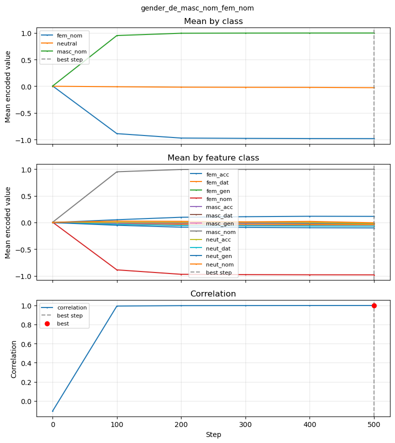
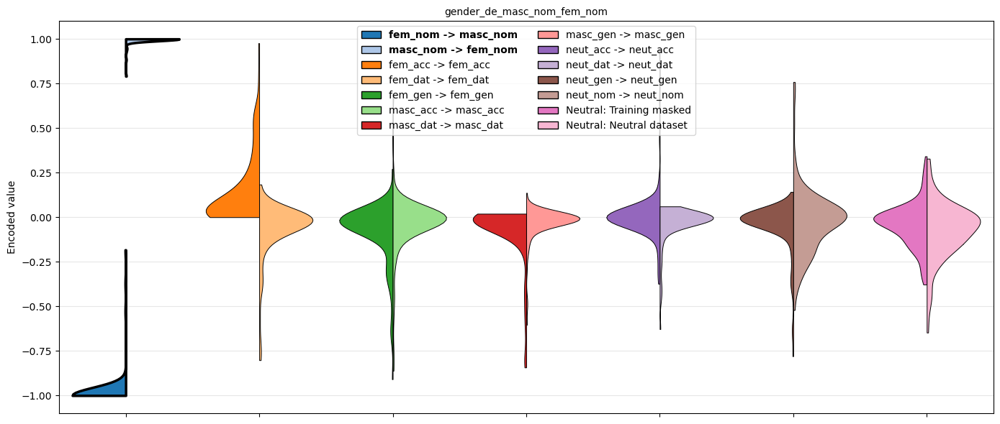
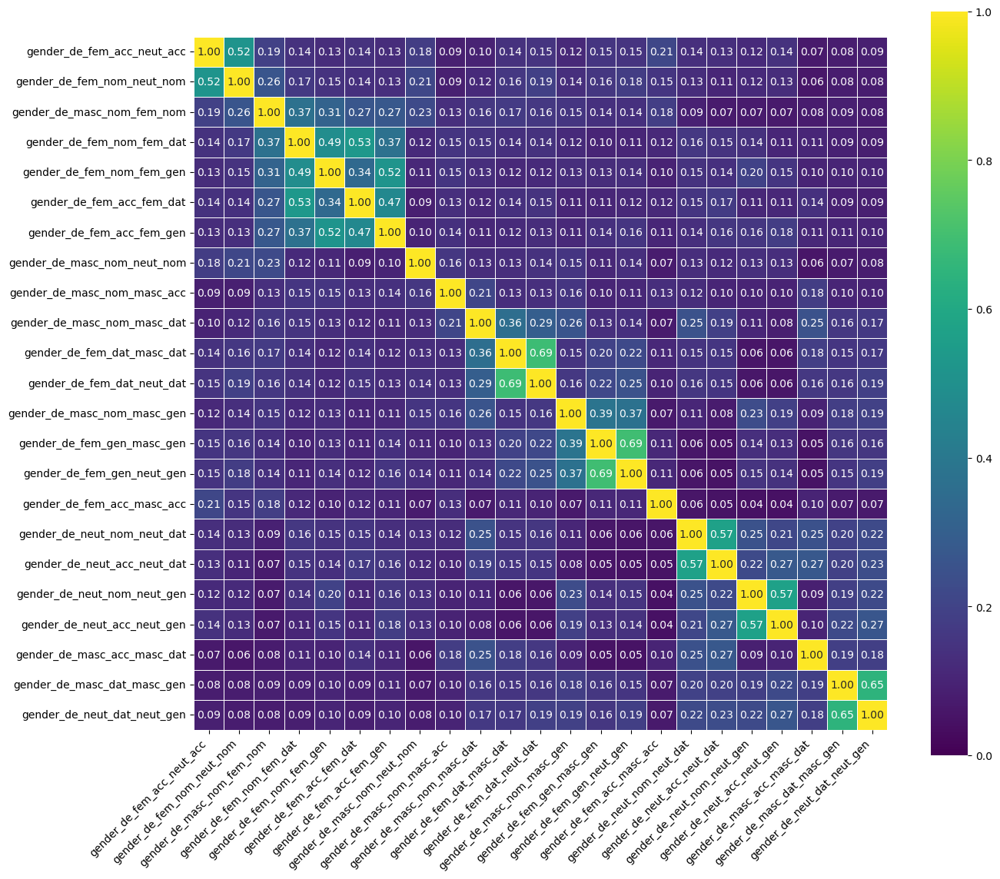
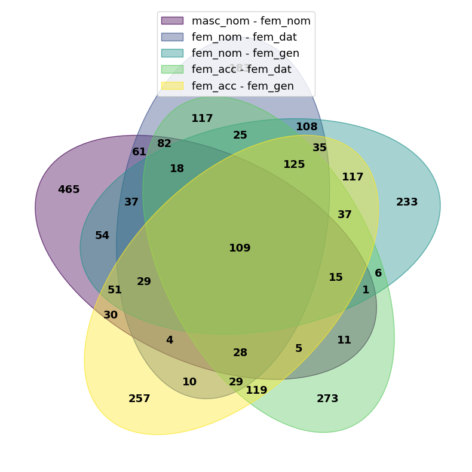

# Evaluation visualization

This guide documents all plot functions available for visualizing GRADIEND training and evaluation. It focuses on **plot customization** only — for how to run evaluation (encoder, decoder, metrics), see [Tutorial: Evaluation (intra-model)](../tutorials/evaluation-intra-model.md) and [Tutorial: Evaluation (inter-model)](../tutorials/evaluation-inter-model.md).

---

## Plot overview

| Plot | Purpose | Entry point |
|------|---------|-------------|
| **Training convergence** | Mean encoded values and correlation over training steps | `trainer.plot_training_convergence()` |
| **Encoder distributions** | Split violins of encoded values by class/transition | `trainer.plot_encoder_distributions()` or `evaluate_encoder(..., plot=True, plot_kwargs=...)` |
| **Encoder scatter** | Interactive 1D scatter (jitter x, encoded y) for outlier inspection | `trainer.plot_encoder_scatter()` |
| **Top-k overlap heatmap** | Pairwise overlap of top-k weight sets across models | `plot_topk_overlap_heatmap()` |
| **Top-k overlap Venn** | Venn diagram of top-k set intersection (2–6 models) | `plot_topk_overlap_venn()` |

---

## 1. Training convergence plot

Shows how training metrics evolve over steps: mean encoded value per class/feature class and correlation. The best checkpoint step (by convergence metric) is marked with a vertical line.

### Entry points

```python
# Via trainer (typical)
trainer.plot_training_convergence()

# Standalone (from model dir or pre-loaded stats)
from gradiend.visualizer.convergence import plot_training_convergence

plot_training_convergence(model_path="runs/experiment/model", show=True)
plot_training_convergence(training_stats=stats_dict, output="convergence.pdf")
```



### Customization options

| Parameter | Type | Default | Description |
|-----------|------|---------|-------------|
| `label_name_mapping` | `Dict[str, str]` | `None` | Map class/feature-class ids to display labels (e.g. `"masc_nom"` → `"Masc. Nom."`). Use when raw ids are technical or hard to read. |
| `plot_mean_by_class` | `bool` | `True` | Include subplot for mean encoded value per class. |
| `plot_mean_by_feature_class` | `bool` | `True` | Include subplot for mean encoded value per feature class. |
| `plot_correlation` | `bool` | `True` | Include subplot for correlation over steps. |
| `best_step` | `bool` | `True` | Draw vertical line and mark best checkpoint step. |
| `title` | `str` or `bool` | `True` | `True` = use `run_id`, `False` = no title, string = custom title. |
| `figsize` | `Tuple[float, float]` | `None` | Figure size in inches. Default: `(8, 3 * n_subplots)`. |
| `output` | `str` | `None` | Explicit output file path. |
| `experiment_dir` | `str` | `None` | Used to resolve default artifact path when `output` is not set. |
| `show` | `bool` | `True` | Whether to call `plt.show()`. |
| `img_format` | `str` | `"pdf"` | Image format (e.g. `"pdf"`, `"png"`). Appended to output path. |

### Use cases

- **Human-readable class labels** (e.g. German article paradigm): pass `label_name_mapping` so legend shows "Masc. Nom." instead of `masc_nom`. See [gender_de_detailed.py](https://github.com/aieng-lab/gradiend/blob/main/gradiend/examples/gender_de_detailed.py).
- **Publication-ready figure**: set `output`, `figsize`, and `img_format="png"` or `"pdf"`.
- **Minimal plot** (only correlation): set `plot_mean_by_class=False`, `plot_mean_by_feature_class=False`.

---

## 2. Encoder distribution plot

Grouped split violins showing the distribution of encoded values by transition/class. Each group has left and right halves, such that, for instance the two sides of the target transitions are shown in a split violin (e.g. masc→fem vs fem→masc is shown ).

### Entry points

```python
# Via trainer (requires encoder_df from evaluate_encoder)
enc_eval = trainer.evaluate_encoder(max_size=100, return_df=True, plot=True, plot_kwargs={...})

# Direct call with pre-computed encoder_df
trainer.plot_encoder_distributions(encoder_df=enc_df, legend_name_mapping={...})
```



### Customization options (via `plot_kwargs` or direct call)

| Parameter | Type | Default | Description |
|-----------|------|---------|-------------|
| `legend_name_mapping` | `Dict[str, str]` | `None` | Map raw legend labels to display names (e.g. `"masc_nom -> fem_nom"` → `"M→F"`). |
| `legend_group_mapping` | `Dict[str, List[str]]` | `None` | Group multiple transitions into one legend entry. Keys = display label; values = list of raw labels to merge. Groups are downsampled to balance counts. Example: `{"der": ["masc_nom -> masc_nom", "fem_dat -> fem_dat"], "die": ["fem_nom -> fem_nom", "fem_acc -> fem_acc"]}`. |
| `paired_legend_labels` | `List[str]` | `None` | Explicit order of legend labels. Consecutive pairs (0,1), (2,3), … form split violins. |
| `violin_order` | `List[str]` | `None` | Order of violin groups on the x-axis (by legend label name). |
| `colors` | `Dict[str, str]` | `None` | Map legend labels to hex colors. |
| `cmap` | `str` | `"tab20"` | Matplotlib colormap for palette. |
| `legend_loc` | `str` | `"best"` | Matplotlib legend location. |
| `legend_ncol` | `int` | `2` | Number of columns in the legend. |
| `title` | `str` or `bool` | `True` | `True` = use `run_id`, `False` = no title, string = custom title. |
| `title_fontsize` | `float` | `None` | Title font size. |
| `label_fontsize` | `float` | `None` | Axis tick label font size. |
| `axis_label_fontsize` | `float` | `None` | Axis label font size. |
| `legend_fontsize` | `float` | `None` | Legend text font size. |
| `output` | `str` | `None` | Explicit output path. |
| `output_dir` | `str` | `None` | Output directory when `output` and `experiment_dir` are not set. |
| `show` | `bool` | `True` | Whether to call `plt.show()`. |
| `img_format` | `str` | `"pdf"` | Image format (e.g. `"pdf"`, `"png"`). |

### Use cases

- **Renaming labels** for readability: `legend_name_mapping={"masc_nom -> fem_nom": "M→F", "fem_nom -> masc_nom": "F→M"}`. See [gender_de_detailed.py](https://github.com/aieng-lab/gradiend/blob/main/gradiend/examples/gender_de_detailed.py).
- **Grouping by surface form** (e.g. all “der” transitions together): `legend_group_mapping={"der": ["masc_nom -> masc_nom", "fem_dat -> fem_dat", ...], "die": [...], "das": [...]}`. See [gender_de_detailed.py](https://github.com/aieng-lab/gradiend/blob/main/gradiend/examples/gender_de_detailed.py).
- **Custom colors** for specific classes: `colors={"M→F": "#1f77b4", "F→M": "#ff7f0e"}`.
- **Paper-style plot**: set `legend_fontsize`, `axis_label_fontsize`, `output`, `img_format="png"`.

---

## 3. Encoder scatter plot

Interactive Plotly scatter: x = jitter, y = encoded value, colored by a chosen column. Intended for Jupyter to inspect outliers (hover shows point data).

**Optional dependency:** Plotly is required for this plot. Install with `pip install plotly`. If Plotly is not installed, the function returns `None` and logs a warning. See [Installation](../installation.md#optional-interactive-encoder-scatter-plotly).

**Example:** Jupyter notebook `gradiend/examples/encoder_scatter.ipynb` — trains on HuggingFace data (`aieng-lab/gradiend_race_data`), runs encoder evaluation, and shows the interactive scatter inline.

### Entry point

```python
trainer.plot_encoder_scatter(encoder_df=enc_df)
```

### Customization options

| Parameter | Type | Default | Description |
|-----------|------|---------|-------------|
| `encoder_df` | `pd.DataFrame` | `None` | Pre-computed encoder analysis. If `None`, calls `trainer.analyze_encoder()`. |
| `color_by` | `str` | `"label"` | Column used for point color. |
| `hover_cols` | `List[str]` | `None` | Columns shown on hover. Default: existing cols among `text`, `label`, `encoded`, `source_id`, `target_id`, `type`. |
| `jitter_scale` | `float` | `0.15` | Scale of random jitter on x-axis. |
| `max_points` | `int` | `None` | Max number of points; subsampling is stratified. |
| `stratify_by` | `str` | `None` | Column for stratified subsampling when `max_points` is set. Default: `feature_class` or `color_by`. |
| `cmap` | `str` | `"tab20"` | Matplotlib colormap for colors (matches encoder violins). |
| `height` | `int` | `500` | Figure height in pixels. |
| `title` | `str` | `None` | Plot title. |
| `output_path` | `str` | `None` | Path to save HTML. |
| `output_dir` | `str` | `None` | Directory for HTML when `output_path` and `experiment_dir` are not set. |
| `show` | `bool` | `True` | Whether to display the figure. |
| `hover_text_max_chars` | `int` | `50` | Max characters for `text` in hover; truncated around first `[MASK]` with `...`. |

### Use case

- **Outlier inspection in Jupyter**: run with default `show=True`; hover over points to see `text`, `label`, etc.
- **Large datasets**: set `max_points=500` to avoid slow rendering; use `stratify_by="feature_class"` to keep class balance.

---

## 4. Top-k overlap heatmap

Heatmap of pairwise overlap between top-k weight index sets across multiple GRADIEND models. Rows and columns are model ids; cell value is overlap (raw count or normalized fraction for easier compatibility).

### Entry point

```python
from gradiend.visualizer.topk.pairwise_heatmap import plot_topk_overlap_heatmap

models = {t.run_id: t.get_model() for t in trainers}
plot_topk_overlap_heatmap(
    models,
    topk=1000,
    part="decoder-weight",
    output_path="topk_overlap_heatmap.png",
)
```


### Parameters

| Parameter | Type | Default | Description |
|-----------|------|---------|-------------|
| `models` | `Dict[str, ModelWithGradiend]` | required | Mapping from model id (used as axis label) to model. |
| `topk` | `int` | `1000` | Number of top weights per model. |
| `part` | `str` | `"decoder-weight"` | Weight part for importance ranking: `encoder-weight`, `decoder-weight`, `decoder-bias`, or `decoder-sum`. |
| `value` | `str` | `"intersection"` | Cell value: `"intersection"` (raw \|A ∩ B\|) or `"intersection_frac"` (\|A ∩ B\| / k). Use `"intersection_frac"` for cross-experiment comparison. |
| `order` | `str` or `List[str]` | `"input"` | Order of models on axes: `"input"` (dict order), `"name"` (alphabetical), or explicit list. Ignored if `pretty_groups` is set. |
| `cluster` | `bool` | `False` | Reorder models by similarity (greedy) so similar models are adjacent. |
| `annot` | `bool` or `str` | `"auto"` | `True` = always annotate cells, `False` = never, `"auto"` = annotate only if ≤ 25 models. |
| `fmt` | `str` | `None` | Format string for annotations (e.g. `"d"`, `".2f"`). Default: `"d"` for intersection, `".2f"` for fraction. |
| `figsize` | `Tuple[float, float]` | `None` | Figure size. Default: `(max(14, n*0.4), max(14, n*0.4))`. |
| `cmap` | `str` | `"viridis"` | Colormap for heatmap. |
| `vmin`, `vmax` | `float` | `None` | Colormap bounds. Default: [0, k] for intersection, [0, 1] for fraction. |
| `scale` | `str` | `"linear"` | Color scale: `"linear"`, `"log"`, `"sqrt"`, or `"power"`. |
| `scale_gamma` | `float` | `None` | Gamma for `scale="power"` (e.g. 0.5 for sqrt-like). |
| `pretty_labels` | `Dict[str, str]` | `None` | Map model id → display label. |
| `pretty_groups` | `Dict[str, List[str]]` | `None` | Map group name → list of model ids. Groups are shown on top/right; ids must be disjoint. Uncovered ids go to `"Other"`. |
| `show_values` | `bool` | `None` | Override `annot` for cell annotations. |
| `annot_fontsize` | `float` | `None` | Font size for cell annotations. |
| `tick_label_fontsize` | `float` | `None` | Font size for axis tick labels. |
| `group_label_fontsize` | `float` | `None` | Font size for group labels (when `pretty_groups` is set). |
| `cbar_pad` | `float` | `None` | Padding between heatmap and colorbar. |
| `title` | `str` or `bool` | `False` | Plot title. Default title is auto-generated. |
| `output_path` | `str` | `None` | Path to save the figure. |
| `show` | `bool` | `True` | Whether to call `plt.show()`. |
| `return_data` | `bool` | `True` | Return overlap matrix and auxiliary data. |

### Use cases

- **Compare many runs** (e.g. German article paradigm): use `pretty_labels` to shorten run ids and `pretty_groups` to group by transition (e.g. "der ↔ die"). See [gender_de_detailed.py](https://github.com/aieng-lab/gradiend/blob/main/gradiend/examples/gender_de_detailed.py).
- **Normalized comparison across experiments**: `value="intersection_frac"`.
- **Clustered layout**: `cluster=True` to order models by similarity.
- **Publication**: set `output_path`, `figsize`, `tick_label_fontsize`, `annot_fontsize`.

---

## 5. Top-k overlap Venn diagram

Venn diagram showing the intersection of top-k weight sets across 2–6 models. For 2–3 models uses `matplotlib-venn`; for 4–6 uses the `venn` package.

### Entry point

```python
from gradiend.visualizer.topk import plot_topk_overlap_venn

plot_topk_overlap_venn(
    models,
    topk=1000,
    part="decoder-weight",
    output_path="topk_overlap_venn.png",
)
```




### Parameters

| Parameter | Type | Default | Description |
|-----------|------|---------|-------------|
| `models` | `Dict[str, ModelWithGradiend]` | required | Mapping from model id to model. Must have 2–6 entries. |
| `topk` | `int` | `1000` | Number of top weights per model. |
| `part` | `str` | `"decoder-weight"` | Weight part: `encoder-weight`, `decoder-weight`, `decoder-bias`, or `decoder-sum`. |
| `output_path` | `str` | `None` | Path to save the figure. |
| `show` | `bool` | `True` | Whether to call `plt.show()`. |

### Return value

Dict with `per_model` (model_id → list of weight indices), `intersection`, `union`, `topk`, `part`. Useful for downstream analysis.

### Dependencies

- 2–3 models: `pip install matplotlib-venn`
- 4–6 models: `pip install venn`

---

## Image format and output paths

Plots that save to disk use `img_format` (e.g. `"pdf"`, `"png"`) when available. If `experiment_dir` is set via `TrainingArguments`, the trainer resolves default paths under that directory (e.g. `[experiment_dir]/[run_id]/training_convergence.pdf`). You can override with explicit `output`, `output_path`, or `output_dir` parameters.

---

## Example references

| Script | Plots demonstrated |
|--------|--------------------|
| [gender_de_detailed.py](https://github.com/aieng-lab/gradiend/blob/main/gradiend/examples/gender_de_detailed.py) | Training convergence with `label_name_mapping`; encoder distributions with `legend_group_mapping`; top-k heatmap with `value="intersection_frac"`; top-k Venn per transition. |
| [gender_de.py](https://github.com/aieng-lab/gradiend/blob/main/gradiend/examples/gender_de.py) | Basic training convergence, encoder distributions, decoder evaluation. |
| [race_religion.py](https://github.com/aieng-lab/gradiend/blob/main/gradiend/examples/race_religion.py) | Encoder distributions via `evaluate_encoder(..., plot=True)`. |
| [evaluation-inter-model](../tutorials/evaluation-inter-model.md) | Top-k overlap concepts, heatmap and Venn usage. |
