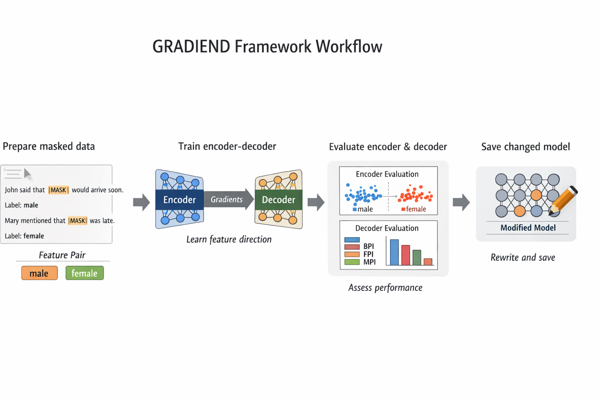

# Documentation

## What is GRADIEND?

GRADIEND is a method for **learning features within neural networks** by training an encoder-decoder architecture on model gradients. With this library you can **find where a language model encodes a feature** (e.g. gender, race, religion) and **rewrite the model** to strengthen or weaken it—for example debias it—while keeping other behaviour.

GRADIEND works by:
1. **Training an encoder-decoder network** on gradients computed from masked text predictions
2. **Learning a single latent feature neuron** that encodes the desired interpretation (e.g., gender bias)
3. **Using the decoder** to modify the base model's weights, enabling targeted feature manipulation

The method is described in detail in the paper: **[GRADIEND: Feature Learning within Neural Networks Exemplified through Biases](https://arxiv.org/abs/2502.01406)** (Drechsel & Herbold, 2025).

The library currently supports **text** models (MLM/CLM). Example use cases:

- **[English gender (pronouns)](https://github.com/aieng-lab/gradiend/blob/main/gradiend/examples/gender_en.py)**
- **[German gender–case](https://github.com/aieng-lab/gradiend/blob/main/gradiend/examples/gender_de_detailed.py)**
- **[Race and religion](https://github.com/aieng-lab/gradiend/blob/main/gradiend/examples/race_religion.py)**

> TODO: Replace this AI-generated schematic with a custom one that shows the main components and workflow of the library. The schematic should include the base model, encoder, decoder, training data, and evaluation components, and how they connect in the GRADIEND process.

---

## Get started

- **[Installation](installation.md)** — Install the package and optional dependencies.
- **[Start here](start.md)** — A minimal runnable example to train and evaluate in a few steps.
- **[Testing and coverage](guides/testing.md)** — Run unit tests, measure coverage, and run the test bench (Docker).

---

## Tutorials

Step-by-step workflows in the order you’d use them:

1. **[Data generation](tutorials/data-generation.md)** — Build training and neutral data from raw text (syncretism, spaCy, one filter per grammatical cell). Part 1 of the detailed workflow.
2. **[Training](tutorials/training.md)** — Experiment layout, pruning (pre/post), multi-seed, convergence plot, and training options in detail.
3. **[Evaluation (intra-model)](tutorials/evaluation-intra-model.md)** — Encoder and decoder evaluation, selecting/saving the changed model.
4. **[Evaluation (inter-model)](tutorials/evaluation-inter-model.md)** — Comparing multiple runs: top-k overlap and heatmap.
5. **[Detailed workflow (overview)](tutorials/detailed-workflow.md)** — Precomputed vs generated data; how the parts connect in one run.

---

## Guides

When you need to understand a topic or look up options:

- **[Core classes and use cases](guides/core-classes.md)** — Overview of the most important classes and when to use them.
- **[Data handling](guides/data-handling.md)** — Data formats, columns, and balancing (DataFrames, per-class dicts, Hugging Face datasets).
- **[Pruning](guides/pruning-guide.md)** — Pre-pruning (from gradients) and post-pruning (from weights); when and how to use them.
- **[Evaluation & visualization](guides/evaluation-visualization.md)** — Encoder and decoder evaluation, convergence and top-k plots, and how to customize plots.
- **[Saving & loading](guides/saving-loading.md)** — Where results are stored and how to reload a trained model.
- **[Training arguments](guides/training-arguments.md)** — Full parameter reference, including multi-seed training and seed report format.
- **[Decoder-only models](guides/decoder-only.md)** — Use causal (decoder-only) LMs with the same API; optional MLM head for better mask gradients.

---

## Reference

- [Examples](examples.md) — All example scripts with short descriptions.
- [API reference](api/index.md) — **Auto-generated** from docstrings; main classes and entry points.
- [FAQ](faq.md) — Troubleshooting and common pitfalls.

To **publish** the docs (e.g. GitHub Pages or Read the Docs) so they are publicly accessible with the package, see [Publishing the documentation](publishing-docs.md).
