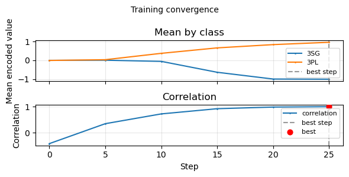
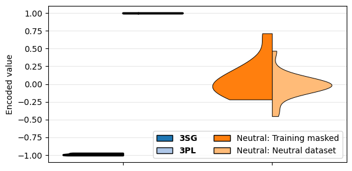

# Start here

This page walks through a **self-contained** workflow: you train and evaluate a GRADIEND model for singular-plural feature based on English third person pronouns.

**Runnable script:** [gradiend/examples/start_workflow.py](https://github.com/aieng-lab/gradiend/blob/main/gradiend/examples/start_workflow.py). 

```bash
python -m gradiend.examples.start_workflow
```


## 1. Create data with `TextPredictionDataCreator`

To extract the desired feature *singular-plural*, we extract data where feature-related tokens are masked. We use third-person pronouns in English for that, i.e., *he*/*she*/*it* (3SG) and *they* (3PL). We need some base data to filter from and extract masks (e.g., *he* gets replaced by *[MASK]*); for the sake of this simple example, we use an explicit list of texts (75+ in the runnable script; a short excerpt is shown below):

```python
ARTIFICIAL_TEXTS = [
    "The chef tasted the soup, then he added a pinch of pepper and stirred it.",
    "The pianist closed her eyes and played the final chord; she had practised it for weeks.",
    "The dog ran to the door; it wanted to go outside and chase the ball.",
    # ...
]
```
We need to mask the pronouns in the texts, e.g., "The chef tasted the soup, then [MASK] added ..." , with the *factual* label being "he" based on the original text. For GRADIEND, we later automatically consider also the *counterfactual/alternative* target *they* by the chosen feature. Symmetrical, we derive texts with factual *they* and counterfactual *he*/*she*/*it*.

!!! tip "You want to run this tutorial? Copy the full list"
    The tutorial shows only three texts. For a working run you need enough 3SG/3PL sentences. Expand below to see enough texts for a successful training run — use the copy button on the code block to paste them into your script.

??? "Copy all 75+ texts"
    ```python
    ARTIFICIAL_TEXTS = [
        "The chef tasted the soup, then he added a pinch of pepper and stirred it.",
        "The pianist closed her eyes and played the final chord; she had practised it for weeks.",
        "The dog ran to the door; it wanted to go outside and chase the ball.",
        "The report will be ready for review by the end of the week.",
        "His phone rang twice before he picked it up and left the room.",
        "She handed the package to the courier and asked them to deliver it by noon.",
        "The players huddled on the pitch before they ran back to their positions.",
        "The author read a paragraph from his novel and then they asked him questions.",
        "Breakfast is included for all guests staying at the hotel.",
        "The nurse checked her clipboard and told the family they could visit soon.",
        "The birds gathered on the wire; when the cat moved they flew away at once.",
        "The mechanic wiped his hands and said the car would be ready by Friday; he had fixed it.",
        "She opened the window and watched the leaves fall in the garden below.",
        "The committee met on Tuesday and they voted to postpone the decision.",
        "When the referee blew the whistle he showed the player a yellow card.",
        "The volunteers packed the boxes and said they would load the van at dawn.",
        "Her brother sent a text saying they were stuck in traffic together.",
        "The dog barked at the postman and he dropped the letters when it lunged.",
        "The meeting ran over time so the chair cut the last two items; they agreed to meet again.",
        "The weather improved by the afternoon and the streets dried quickly.",
        "Rain poured all morning but the basement stayed dry; the pump had run all night and it held.",
        "She found the recipe in the drawer; it calls for butter, flour, and a pinch of salt.",
        "The road was closed for repairs and they said the detour would add twenty minutes.",
        "The film ended at midnight and they all went home in the rain.",
        "The museum opens at nine and closes at six on weekdays.",
        "Trains run every fifteen minutes during peak hours.",
        "The recipe works best when the oven is preheated properly.",
        "The meeting has been moved to the smaller room on the third floor.",
        "The gardener pruned the roses and he left the cuttings by the gate.",
        "The drummer lost her stick in the middle of the song but she kept the beat.",
        "One of the students raised her hand and asked them to repeat the question.",
        "The board announced that they had approved the budget; the CEO signed it.",
        "He left the book on the table and she noticed the door was open when it swung.",
        "The car broke down on the motorway and it had to be towed away.",
        "The cat jumped off the wall; it landed in the flower bed and ran off.",
        "They offered him a seat but he preferred to stand; she nodded and they sat down.",
        "Coffee was served in the lobby while the conference continued upstairs.",
        "Keys were left on the counter by the front door.",
        "Parking is available in the lot behind the building.",
        "The driver signalled left and he turned into the car park.",
        "She replied to the email before they had a chance to follow up.",
        "The laptop was slow so it needed a restart and more memory.",
        "The lecture will be recorded and posted online by tomorrow.",
        "His keys fell under the seat and he had to reach for them.",
        "They invited her to the meeting and she accepted on the spot.",
        "The team celebrated after they won the final match.",
        "The manager gave his approval and then they scheduled the launch.",
        "Lunch will be served in the canteen from twelve to two.",
        "The doctor checked her notes and told the patient they could go home.",
        "The crowd cheered when they saw the result on the screen.",
        "When the alarm went off he switched it off and got up.",
        "The staff finished the inventory and they reported the count.",
        "Her colleague forwarded the file and they opened it together.",
        "The cat stretched and it jumped onto the sofa.",
        "The council met last night and they approved the new bylaws.",
        "The coach gave his feedback and they practised the drill again.",
        "The intern made her first presentation and they asked a few questions.",
        "The dog waited by the bowl; it had not been fed yet.",
        "The panel discussed the proposal and they reached a consensus.",
        "He locked the office and she set the alarm before they left.",
        "The van pulled up and it unloaded the delivery at the back.",
        "The results are published on the intranet every Friday.",
        "The neighbour waved to her and she waved back as they passed.",
        "Snow fell all day but the gritters had been out and it cleared.",
        "The schedule is on the wall next to the break room.",
        "The bus was late so they missed the start of the film.",
        "The document is in the shared folder and can be edited by anyone.",
        "The waiter brought the bill and he left the tip on the table.",
        "The singer forgot the words but she carried on and they applauded.",
        "The printer ran out of paper and it stopped mid-job.",
        "The deadline has been extended to the end of the month.",
        "The committee will reconvene next week to finalise the report.",
        "Tea and biscuits are provided in the kitchen on each floor.",
        "She booked the room and they confirmed the reservation by email.",
        "The gate was left open so the horse got out and it wandered off.",
        "The contract is valid for twelve months from the signing date.",
    ]
    ```

This package provides an easy way to derive such masked texts using `TextPredictionDataCreator`. This basic example uses basic string matching based on `TextFilterConfig` (see [here](guides/data-handling.md) for advanced filtering based on [spacy](https://spacy.io/)).

```python
from gradiend import TextPredictionDataCreator, TextFilterConfig
creator = TextPredictionDataCreator(
    base_data=ARTIFICIAL_TEXTS,
    feature_targets=[
        TextFilterConfig(targets=["he", "she", "it"], id="3SG"),
        TextFilterConfig(targets=["they"], id="3PL"),
    ],
)
training = creator.generate_training_data(max_size_per_class=10)
```
This creates training data for GRADIEND, automatically split into train/validation/test splits.

To evaluate GRADIEND models, a dataset being independant (*neutral*) to the considered feature is useful to enable feature-independant evaluation (e.g., to compute a language modeling score). This is also supported by `TextPredictionDataCreator`. 

```python
NEUTRAL_EXCLUDE = ["i", "we", "you", "he", "she", "it", "they", "me", "us", "him", "her", "them"]
neutral = creator.generate_neutral_data(additional_excluded_words=NEUTRAL_EXCLUDE, max_size=15)
```

## 2. Train a GRADIEND model

With the generated data, we can simply train and evaluate a GRADIEND model encoding the targeted feature (*singular-plural*), by using `TextPredictionTrainer`.

```python
from gradiend import TrainingArguments, TextPredictionTrainer

# use minimal training settings
args = TrainingArguments(
    train_batch_size=4,
    eval_steps=5,
    max_steps=25,
    learning_rate=1e-4,
)
trainer = TextPredictionTrainer(
    model="bert-base-uncased", 
    data=training,
    eval_neutral_data=neutral, 
    args=args)
trainer.train()
```
Based on our used toy training configuration, we just train for 25 steps, considering 4 texts of equal feature class (3SG or 3PL), and evaluate every 5 steps. The training stats can be plotted by using `trainer.plot_training_convergence()`. The plot shows training loss and encoder correlation over steps.

> **Having memory issues?** (e.g. CUDA out of memory errors) — Reduce GPU memory usage with pre-pruning, mixed precision, or smaller batches. See the [Pruning guide](guides/pruning-guide.md), [Training tutorial — Pruning](tutorials/training.md#pruning), and [FAQ](faq.md) for details.

The evaluation results during training can be visualized via `trainer.plot_training_convergence()`, which shows the training loss and encoder correlation over steps. The correlation is computed between the encoded gradients and the feature classes (3SG vs 3PL) on the evaluation set, and is expected to increase during training.




## 3. Evaluate the GRADIEND model

The evaluation of a GRADIEND model consists of two core steps: GRADIEND encoder (to which values are different gradients encoded?) and decoder (can we change the base model's behavior related to the feature?) analysis.

The encoder evaluation uses training data on test split and neutral data, and can be run and plotted using:
```python
enc_result = trainer.evaluate_encoder(plot=True)
print("Correlation:", enc_result.get("correlation"))
```


The decoder evaluation evaluates how the base model can be changed by applying a learnt GRADIEND decoder update like $base-model + learning-rate * decoder(feature-factor)$. By default, we evaluate for a range of learning rates and pick the feature factor (+-1) depending on the feature encoding. The selected changed model is chosen with respect to a language model constraint.
```python
dec = trainer.evaluate_decoder()
changed_base_model = trainer.rewrite_base_model(decoder_results=dec, metric_key="3SG")
```
The `changed_base_model` is expected to be biased towards singular, i.e., assign singular tokens higher probabilities than plural tokens, compared to the (unchanged) base model.

### Merged feature classes

When data has more than two base classes (e.g. 1SG, 1PL, 3SG, 3PL for pronouns), you can merge them to learn higher-level features:

- **Number**: `class_merge_map={"singular": ["1SG", "3SG"], "plural": ["1PL", "3PL"]}`
- **Person**: `class_merge_map={"1st": ["1SG", "1PL"], "3rd": ["3SG", "3PL"]}`

With exactly two merged classes, `target_classes` is inferred automatically. See [english_pronoun_singular_plural.py](https://github.com/aieng-lab/gradiend/blob/main/gradiend/examples/english_pronoun_singular_plural.py).

## What you just did

- Used **TextPredictionDataCreator** to build per-class textual training data (3SG: he/she vs 3PL: they) to extract a user-defined feature by feature-related-gradients.
- Trained a GRADIEND model on gradient differences between the two classes defined by the data.
- Ran **encoder evaluation** (correlation, plots) and **decoder evaluation** (probability shifts).
- Called **rewrite_base_model** to obtain a rewritten model in memory (best configuration for the chosen metric).

## Next steps

- **[Tutorial: Data generation](tutorials/data-generation.md)** — Build training and neutral data from raw text (syncretism, spaCy, morphology).
- **[Tutorial: Training](tutorials/training.md)** — Experiment layout, pruning, multi-seed, convergence plot, and training options in detail.
- **[Tutorial: Evaluation (intra-model)](tutorials/evaluation-intra-model.md)** — Encoder/decoder evaluation and selecting/saving the changed model.
- **[Tutorial: Evaluation (inter-model)](tutorials/evaluation-inter-model.md)** — Comparing multiple runs (top-k overlap, heatmap).
- **[Detailed workflow (overview)](tutorials/detailed-workflow.md)** — Precomputed vs generated data; how the parts connect in one run.
- **[Data handling](guides/data-handling.md)** — All formats the trainer accepts (HF id, DataFrame, per-class dict, …).
- **[Saving & loading](guides/saving-loading.md)** — Where results are stored and how to reload a model.
- **[Pruning](guides/pruning-guide.md)** — Pre- and post-pruning in depth.
- **[Evaluation & visualization](guides/evaluation-visualization.md)** — Customizing plots.
